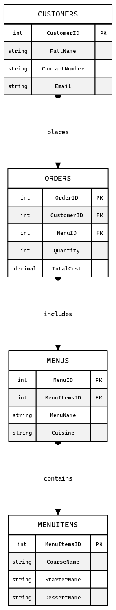
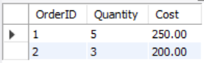
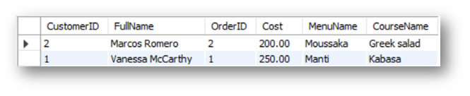
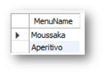

# Exercise 1: Create a Virtual Table to Summarize Data

## Scenario
Little Lemon needs to retrieve data from their database. In this exercise, you will use MySQL to:

- Create a virtual table to summarize data.
- Use a `JOIN` statement to query data from multiple tables.
- Create a SQL statement with a subquery.

## Prerequisites
In the previous module, you developed a data model for Little Lemon and implemented it in MySQL. Your database should now contain several tables, including:

- Menus
- Orders
- MenuItems
- Customers

Table names may differ in your schema, but relationships should resemble the following diagram:



Ensure your schema includes `Quantity` and `TotalCost` in the `Orders` table and `MenuItemsID` in the `Menus` table. The `MenuItems` table should contain item names and categories (`starter`, `main`, `dessert`, `drink`).

Use MySQL Workbench SQL Editor to write the required subquery, virtual table, and `JOIN` statements.

## Task Instructions
Little Lemon needs reports on restaurant orders. Complete the following tasks.

Little Lemon uses an a la carte model. Customers may order any single item, including starter-only, dessert-only, or drinks-only items.

### Task 1
Create a virtual table called `OrdersView` that includes `OrderID`, `Quantity`, and `Cost` columns from the `Orders` table for orders where quantity is greater than `2`.

Guidance:

- Use a `CREATE VIEW` statement.
- Extract order ID, quantity, and cost from `Orders`.
- Filter to orders with `Quantity > 2`.

Query example:

```sql
SELECT * FROM OrdersView;
```

Expected output format (depends on your data):



Depending on your schema, this column may be named `TotalCost`. The screenshot uses `Cost` for simplicity.

### Task 2
Retrieve data from four tables for all customers with orders costing more than `$150`.

Required fields:

- `Customers`: customer ID and full name
- `Orders`: order ID and cost
- `Menus`: menu name
- `MenuItems`: item name and category (`starter`, `main`, `dessert`, `drink`)

Sort the result set by the lowest cost.

Expected output format (depends on your data):



### Task 3
Find all menu items for which more than `2` orders have been placed using a subquery.

Guidance:

- Use the `ANY` operator in a subquery.
- Use the outer query to select the menu name from `Menus`.
- Use the inner query to check if any order quantity in `Orders` is greater than `2`.

Expected output format (depends on your data):



## Conclusion
In this exercise, you created reports using virtual tables, `JOIN` statements, and SQL subqueries.
