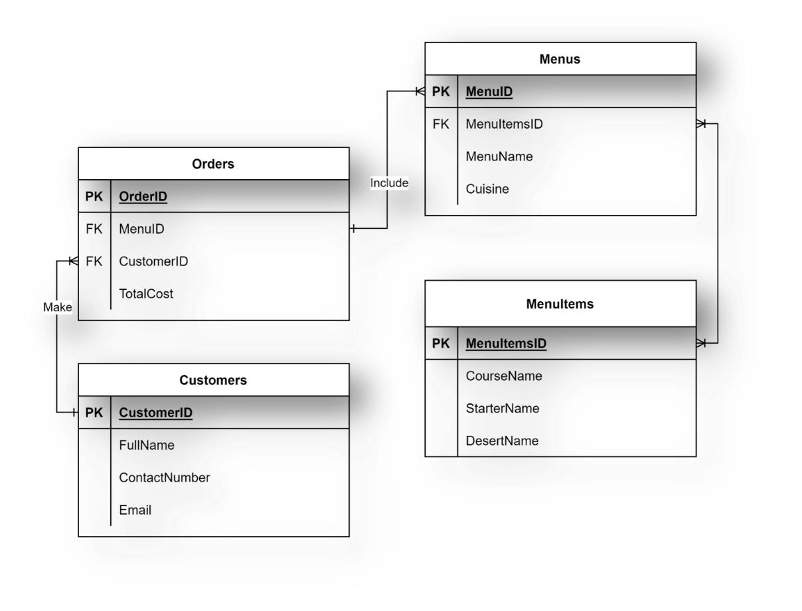
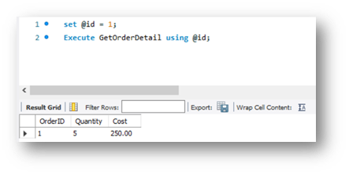
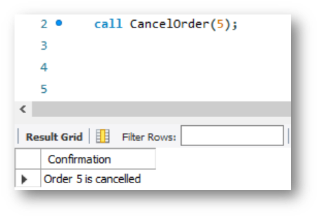

# Exercise 2: Create Optimized Queries to Manage and Analyze Data

## Scenario
Little Lemon needs to query data in their database. To support this, you will create optimized queries using stored procedures and prepared statements.

## Prerequisites
In the previous module, you developed a data model for Little Lemon and implemented it in MySQL. Your database should now contain several tables, including:

- Menus
- Orders
- MenuItems
- Customers

Table names may differ in your schema, but relationships should resemble the following diagram:



Use MySQL Workbench SQL Editor to write the required stored procedures and prepared statements.

## Task 1
Create a stored procedure named `GetMaxQuantity` that displays the maximum ordered quantity in the `Orders` table.

This allows Little Lemon to reuse the logic without rewriting the same query repeatedly.

Call example:

```sql
CALL GetMaxQuantity();
```

Expected output format (depends on your data):


## Task 2
Create a prepared statement named `GetOrderDetail`.

Requirements:

- Accept one input argument: `CustomerID` from a variable.
- Return `OrderID`, `Quantity`, and `TotalCost` from the `Orders` table.

Execution example:

```sql
SET @id = 1;
EXECUTE GetOrderDetail USING @id;
```

Expected output format (depends on your data):



## Task 3
Create a stored procedure named `CancelOrder` that deletes an order record using an input order ID.

This lets Little Lemon cancel orders by passing only the order ID instead of writing the full `DELETE` statement each time.

Expected output format:



## Conclusion
In this exercise, you queried database data using optimized SQL with stored procedures and prepared statements.
