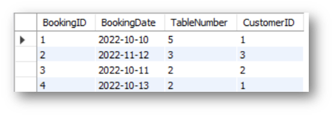
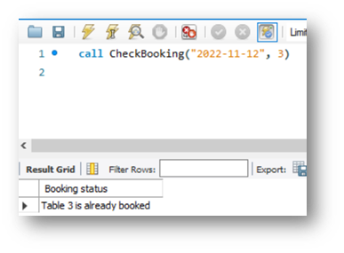
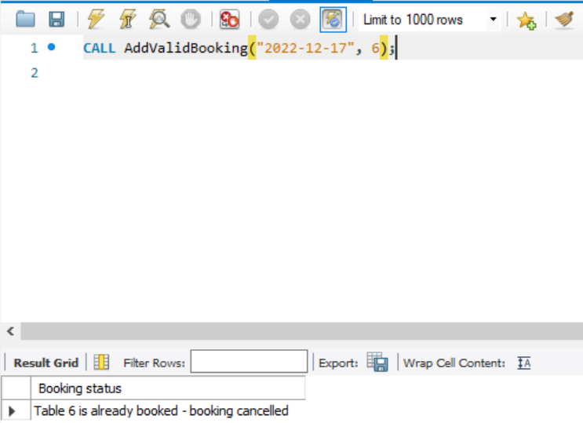

# Exercise 3: Create SQL Queries to Check Available Bookings

## Scenario
Little Lemon's data model must include a `Bookings` table so they can store table-booking data. They also need:

- A stored procedure to check available bookings based on user input.
- A transaction-based procedure to prevent invalid bookings.

Use your MySQL knowledge to implement these requirements.

## Prerequisites
You should have created the Little Lemon database in an earlier module. The database should contain a `Bookings` table linked to a `Customers` table as illustrated below.

Your schema can differ slightly from the example, as long as the required relationship exists.

You also need MySQL Workbench SQL Editor to write the required queries.

## Task 1
Populate the `Bookings` table with the following records using `INSERT` statements:

| BookingID | BookingDate | TableNumber | CustomerID |
| --- | --- | --- | --- |
| 1 | 2022-10-10 | 5 | 1 |
| 2 | 2022-11-12 | 3 | 3 |
| 3 | 2022-10-11 | 2 | 2 |
| 4 | 2022-10-13 | 2 | 1 |

Your output should resemble the following screenshot:

## Task 2
Create a stored procedure named `CheckBooking` to check whether a table is already booked.

Requirements:

- The procedure must accept two input parameters: booking date and table number.
- You can use a variable in the procedure to check table status.

Expected output format:

## Task 3
Create a stored procedure named `AddValidBooking` that verifies bookings and rejects duplicates using a transaction.

Requirements:

- Include two input parameters: booking date and table number.
- Use at least one variable.
- Start with `START TRANSACTION`.
- Insert a new booking record using input parameter values.
- Use an `IF ... ELSE` condition to check whether the table is already booked on the given date.
- If already booked, `ROLLBACK`.
- If available, `COMMIT`.

The screenshot below shows an example rollback (cancelled booking) because table `5` is already booked on the specified date.

## Conclusion
Little Lemon customers can now check available bookings based on user input, and your SQL logic ensures invalid duplicate bookings are declined.
