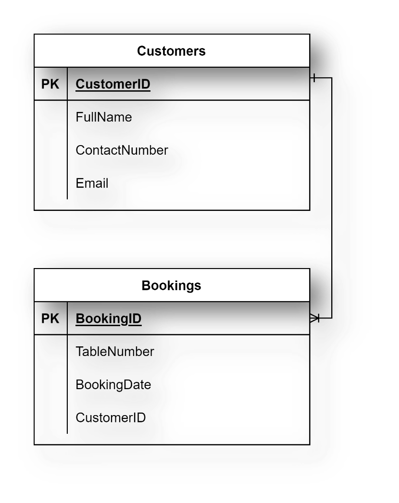
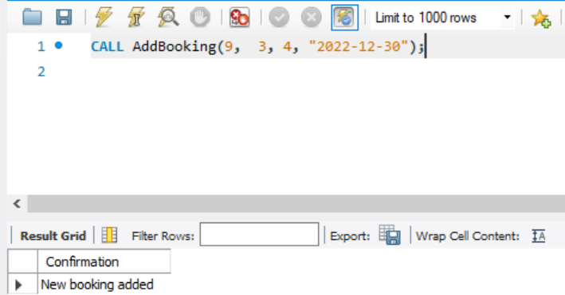
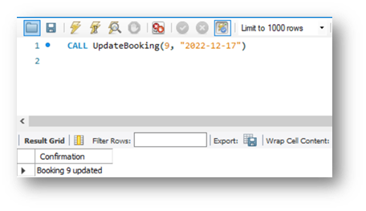
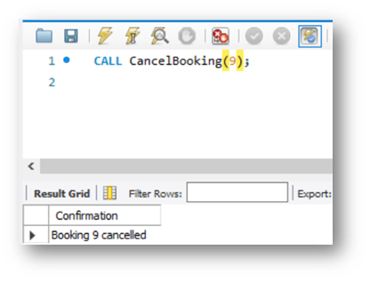

# Exercise 4: Create SQL Queries to Add and Update Bookings

## Scenario
Little Lemon needs help managing bookings. In this exercise, you will create stored procedures they can invoke to add, update, and delete bookings in their database.

## Prerequisites
Your Little Lemon database should include a basic `Bookings` table linked to a `Customers` table. An example is shown below for reference.

Your schema can differ slightly, as long as the required relationship exists.

## Task 1
Create a stored procedure named `AddBooking` to add a new booking record.

Requirements:

- Include four input parameters: booking ID, customer ID, booking date, and table number.

Expected output format:

## Task 2
Create a stored procedure named `UpdateBooking` to update an existing booking in the `Bookings` table.

Requirements:

- Include two input parameters: booking ID and booking date.
- Use an `UPDATE` statement inside the procedure.

Expected output format:

## Task 3
Create a stored procedure named `CancelBooking` to cancel (remove) a booking.

Requirements:

- Include one input parameter: booking ID.
- Use a `DELETE` statement inside the procedure.

Expected output format:

## Conclusion
In this exercise, you created stored procedures for the Little Lemon booking system that support adding, updating, and deleting booking records.
