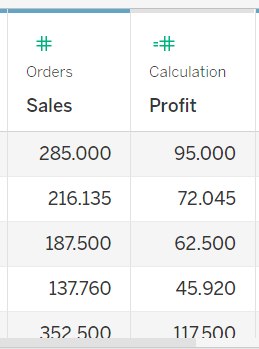

# Exercise 1: Set Up the Tableau Workspace for Data Analysis

## Scenario
Little Lemon has an Excel file with thousands of order records from 2019 to 2023. They want to analyze sales data to identify ways to increase profit. In this exercise, you will prepare the existing data before analysis.

## Prerequisites
Before starting, ensure you have:

- Tableau installed on your machine.
- The Little Lemon DB Excel sheet downloaded locally.

## Task Instructions
Complete the following tasks to set up the Tableau workspace for data analysis.

## Task 1
Connect to Little Lemon data in the Excel sheet named `LittleLemonDB`, then filter data in the data source page to only include `United States` as country.

Guidance:

- Open Tableau.
- In the Connection pane, select Excel and open the data source.
- In the data source page, use the filter tab.

## Task 2
Create two new data fields: `First Name` and `Last Name`. Extract values from the `Full Name` field.

Guidance:

- Use the Split feature in Tableau.
- Rename the generated fields.

## Task 3
Create a calculated field to store profit for each sale (order), as shown in the screenshot below.

Guidance:

- In the Data pane, select `Sales`, then choose Create Calculated Field.
- Name the calculated field `Profit`.
- Use a formula that deducts `Cost` from `Sales`.

Expected output format:

## Conclusion
In this exercise, you prepared Little Lemon data in Tableau and set up the workspace for further analysis and visual reporting.
