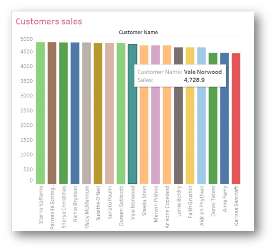
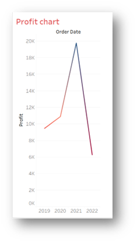
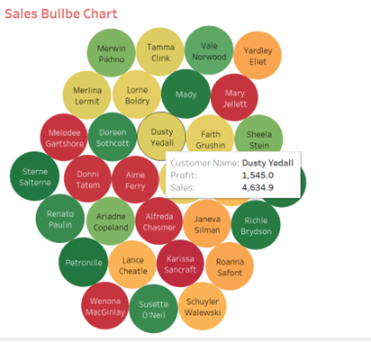
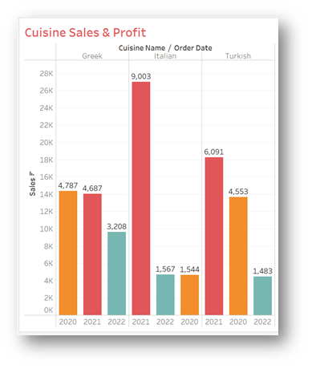
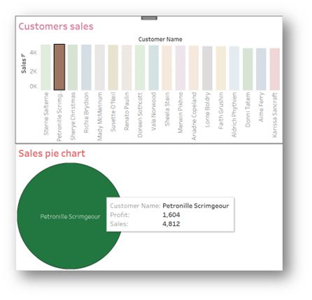

# Exercise 2: Create an Interactive Dashboard for Sales and Profits

## Scenario
In the previous exercise, you prepared Little Lemon data for analytics. In this exercise, you will filter data, analyze it, and build visual charts in an interactive dashboard to help Little Lemon understand business performance and improve sales and profits.

## Prerequisites
Before starting, ensure you have:

- Tableau installed on your machine.
- The Little Lemon DB Excel sheet downloaded locally.

## Task Instructions
Complete the following tasks to build interactive dashboards for sales and profit analysis.

## Task 1
Create a bar chart showing customer sales and filter to sales values of at least `$70`.

Guidance:

- Drag and drop relevant fields from the data pane to shelves.
- Use a suitable color scheme.
- Filter where `Sales >= 70`.
- Name the chart `Customers Sales`.
- On hover, show customer names and sales figures.

Expected output format:

## Task 2
Create a line chart showing sales trend from `2019` to `2022`.

Guidance:

- Drag and drop relevant fields from the data pane.
- Use a suitable color scheme.
- Exclude `2023` from the filter.
- Name the chart `Profit Chart`.

Expected output format:

## Task 3
Create a bubble chart of sales for all customers. The chart should display customer names; on hover, show name, profit, and sales.

Guidance:

- Drag and drop relevant fields from the data pane.
- Use a suitable color scheme.
- Name the chart `Sales Bubble Chart`.

Expected output format:

## Task 4
Compare sales of three cuisines sold at Little Lemon by creating a bar chart for `Turkish`, `Italian`, and `Greek` cuisines.

Requirements:

- Display data for years `2020`, `2021`, and `2022` only.
- Each bar should show profit for each cuisine.

Guidance:

- Drag and drop relevant fields from the data pane.
- Use a suitable color scheme.
- Name the worksheet `Cuisine Sales and Profits`.
- Sort descending by sum of sales.

Expected output format:

## Task 5
Create an interactive dashboard combining `Customers Sales` and `Sales Bubble Chart`. When selecting a bar and hovering the related bubble, display customer name, sales, and profit.

Expected output format:

## Conclusion
In this exercise, you helped Little Lemon analyze sales performance and customer trends through interactive Tableau visualizations.

## Reference Solution
- Tableau Public: `https://public.tableau.com/shared/CHTWXDQSD?:display_count=n&:origin=viz_share_link`
- Packaged workbook: `deliverables/exercise_2_tableau_solution.twbx`
